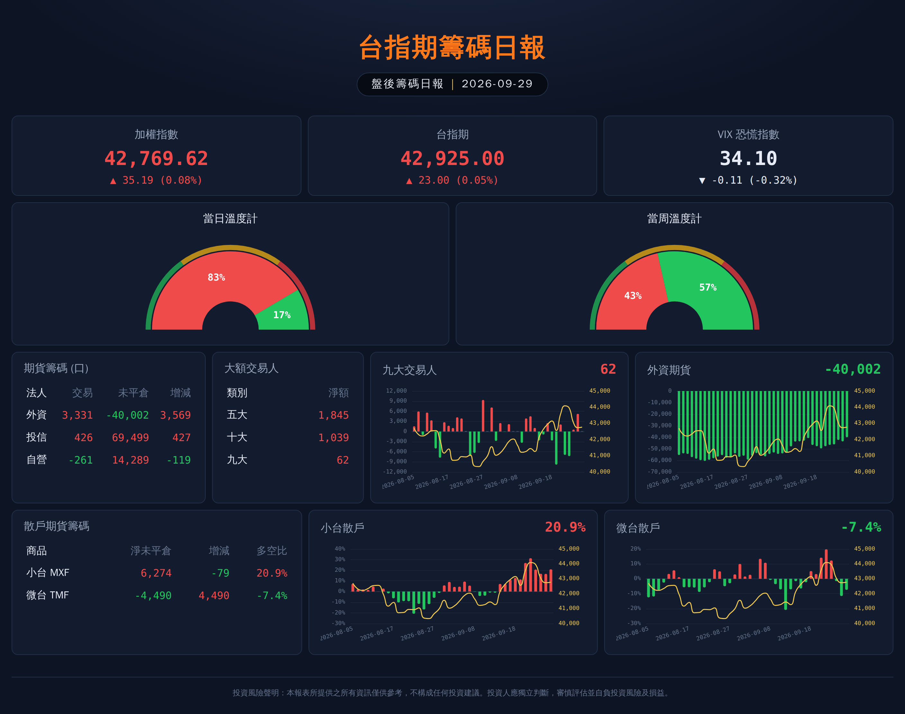

# 台指期盤後籌碼日報

每個交易日收盤後，從證交所（TWSE）和期交所（TAIFEX）抓取公開資料，產生一張深色主題的籌碼日報（HTML，可另存 PNG）。



## 快速開始

```bash
cd futures-report
pip install -r requirements.txt
playwright install chromium        # 只有要輸出 PNG 才需要

# 1. 先用模擬資料看版面（不需網路）
python -m report --png demo --date 2026-09-29

# 2. 回補歷史資料（趨勢圖需要約 40 個交易日）
python -m report backfill --start 2026-08-01

# 3. 每天收盤後執行（期交所資料約 15:00–16:30 公布，建議 16:45 之後）
python -m report --png daily
```

輸出在 `output/report-YYYY-MM-DD.html` 與 `.png`；原始資料存在 `data/report.db`（SQLite）。
HTML 是單一檔案（圖表程式庫已內嵌），直接用瀏覽器打開即可，不需網路。

其他參數：`--title` 改標題、`--db` / `--out` 改路徑；
若已有 Chromium，可用環境變數 `CHROMIUM_PATH=/path/to/chrome` 取代 `playwright install`。

## 資料來源與欄位

| 區塊 | 來源 | 程式 |
|---|---|---|
| 加權指數 | TWSE 每月市場成交資訊 `FMTQIK` | `fetch_taiex` |
| 台指期／小台／微台行情、全市場未平倉 | TAIFEX 期貨每日交易行情 `futDataDown`（TX / MTX / TMF） | `fetch_futures_daily` |
| VIX | TAIFEX 臺指選擇權波動率指數每日檔 | `fetch_vix` |
| 期貨籌碼（外資／投信／自營） | TAIFEX 三大法人－區分各期貨契約 `futContractsDateDown`（TXF / MXF / TMF） | `fetch_institutional` |
| 五大／十大 | TAIFEX 大額交易人未沖銷部位 `largeTraderFutDown`（TX 所有月份、特定法人） | `fetch_large_traders` |

## 推算指標（`report/metrics.py`）

- **散戶淨未平倉** = −（三大法人淨未平倉合計）
- **散戶多空比** = 散戶淨未平倉 ÷ 全市場未平倉量
- **九大交易人（暫定）**：前十大「全部交易人」淨部位。原版定義未公開，確認後改 `nine_traders_net`。
- **當日溫度計（暫定）**：六個多空訊號等權平均——加權指數漲跌、台指期漲跌、外資未平倉增減、十大特定法人淨部位、小台散戶多空比（反指標）、VIX 漲跌（反指標）。
- **當周溫度計**：最近 5 個交易日的當日溫度平均。

顏色採台股慣例：紅＝漲／多、綠＝跌／空。

## 自動排程範例（Linux cron，週一到週五 16:50）

```cron
50 16 * * 1-5  cd /path/to/futures-report && python -m report --png daily >> logs.txt 2>&1
```

## 尚待確認

1. 期交所下載端點的參數與 CSV 欄位是依公開格式撰寫，開發環境連不到期交所，**尚未用真實資料驗證**；第一次執行時請留意 log 裡的「抓取失敗」訊息。
2. VIX 每日檔的網址與格式最不確定，抓不到時報表會顯示「—」，不影響其他區塊。
3. 九大交易人與溫度計的算法是暫定版本。

## 測試

```bash
python -m pytest -q
```
